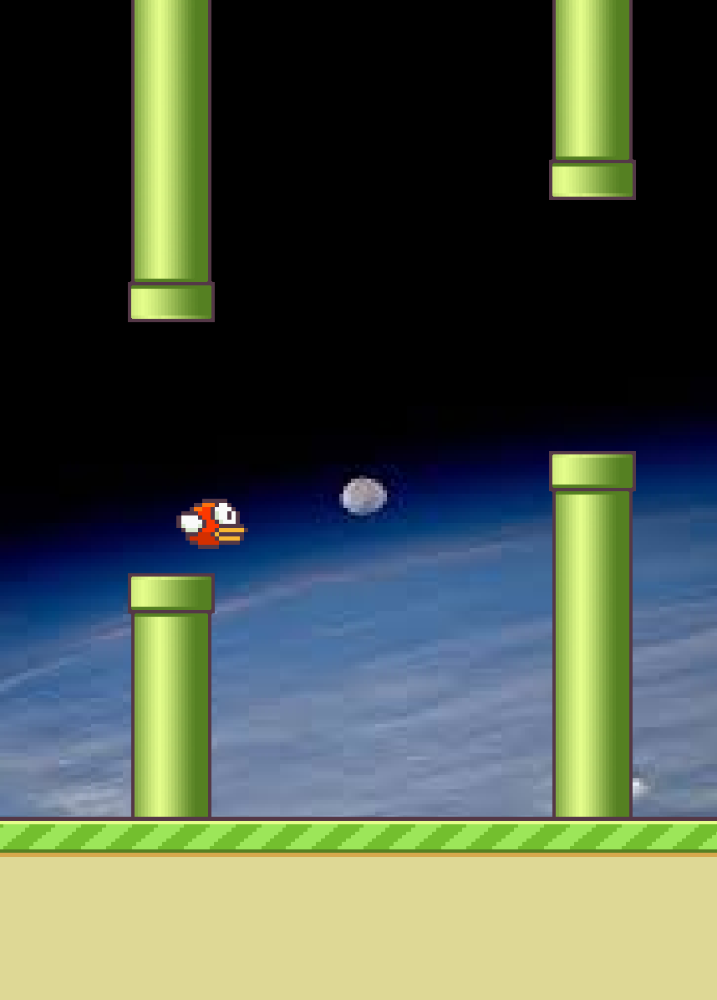
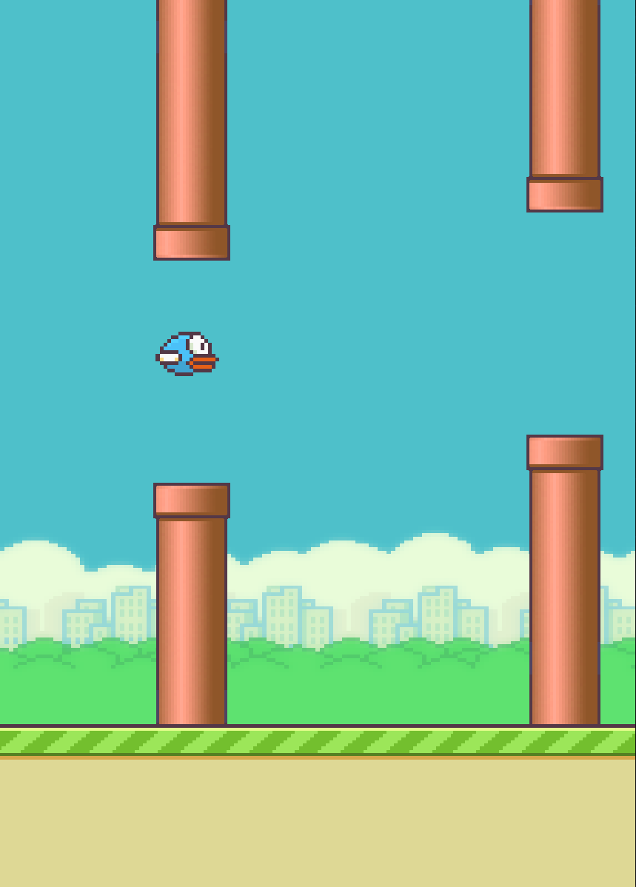
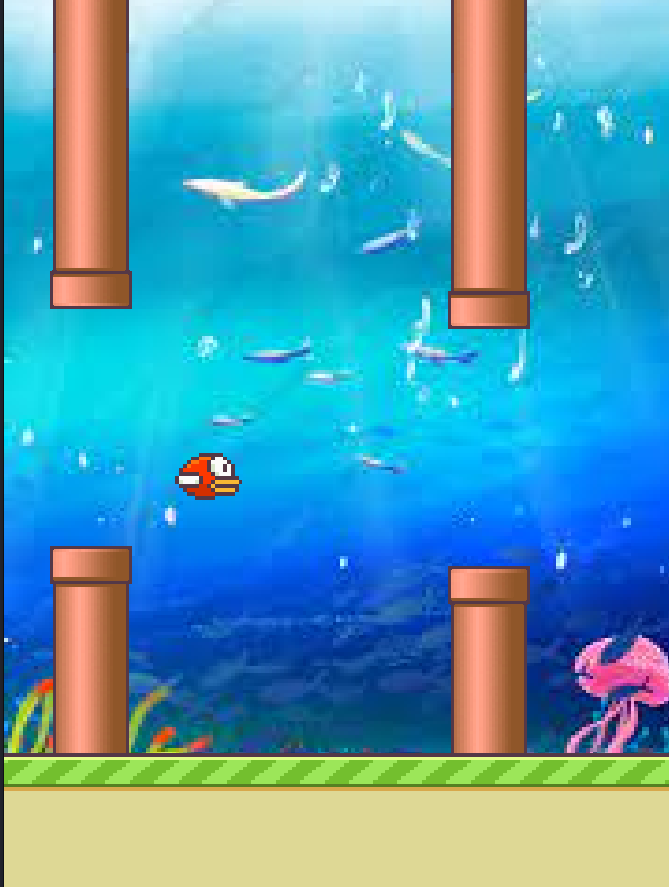

<!--HEADING-->
# *Flapping AI*
<!--Intro-->
__This is my first programming project. I'll be making a clone of the flappy bird game, and an AI that has the ability to play it successfully.__

<!--MAIN INFO-->
## Current updates
### Recent progress
I decided to continue messing with this project today. I have now almost finished the user interactive version. This is what the game currently looks like:




Every time you play, the background is randomly decided to be one of the 5 backgrounds I have added as of today. Eventually, I want to have 20 backgrounds added. 
The pipes are decided to be either red or green at the beginning.
The bird changes color with each jump.
### Next challenges
I have yet to completely finish collisions. I also haven't implemented a welcoming and game over screen, nor a counter that keeps track of the score.
When this is done, I will implement the AI. That hopefully won't be too much of a challenge.

<!--HOW TO RUN THE CODE-->
## Running my program
To see and/or run what I have already written, use the git clone command to download the project:
   ```bash
    $ git clone https://github.com/tibofordeyn/FlappingAI.git
   ```
then run the following command in your terminal:

   ```bash
    $ python3 main.py
   ```

Make sure you have the adequate python version and the pygame library installed.

<!--EXAMPLE OF THE RESULT-->

<!--CLOSING-->
___
__Thanks for looking at my project. Have a nice day! (if you have any tips, pls let me know)__

